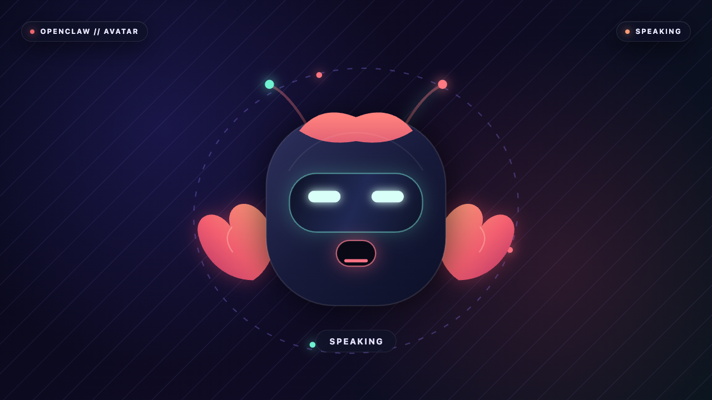

# OpenClaw Avatar Plugin

An external [OpenClaw](https://github.com/openclaw/openclaw) plugin that turns Talk activity into
a polished, local animated avatar. The MVP ships a
code-native animated version of the OpenClaw icon, an authenticated browser host, a canonical
renderer event contract, and bounded session fanout.



The browser never receives provider credentials or runs agent tools. Its default-on microphone
streams PCM into a Gateway-owned Talk session; Gateway owns Realtime, workspace/tool execution,
waiting for agent completion, and the spoken response. The avatar independently observes the
safe activity feed from every Talk surface. Its own interactive session receives exact output PCM
through a session-scoped handle. On older builds, the UI and synthetic demo still work.

## Quick demo

Requirements: Node 22.22.3 or newer and a local Chromium-based browser.

```bash
npm install
npm run demo
```

The command prints an unguessable loopback URL. Open it in a browser. To open it automatically on
macOS:

```bash
npm run demo -- --open
```

The demo cycles through listening, thinking, and speaking with generated PCM16LE 24 kHz mono audio,
then issues an atomic clear so the mouth returns to neutral immediately.

## Live Gateway demo

The live demo uses an owned local Gateway from an OpenClaw `demo/avatar-live` checkout, sends
locally synthesized speech through `talk.session.create` and `talk.session.appendAudio`, and opens
the plugin's authenticated Control UI route. On macOS it first reads the dedicated Keychain item
`openclaw-avatar-plugin` / `OPENAI_AVATAR_DEMO_API_KEY`; when that item is absent it falls back to
the existing OpenClaw `openai:api-key` profile. It never calls OpenAI from the plugin or writes
provider audio or credentials.

Create or update the isolated Keychain item without putting the secret in shell history:

```zsh
read -s "avatar_key?Paste the full API key: "
echo
security add-generic-password -U -s openclaw-avatar-plugin \
  -a OPENAI_AVATAR_DEMO_API_KEY -l "OpenClaw Avatar Demo API Key" -w "$avatar_key"
unset avatar_key
```

```bash
OPENCLAW_CORE_PATH=/path/to/openclaw npm run demo:live
```

To watch the real session, launch the headed mode. It opens Chrome, keeps the live speaking avatar
visible for 15 seconds, cancels output, then holds the listening state for another 15 seconds:

```bash
OPENCLAW_CORE_PATH=/path/to/openclaw npm run demo:live:visible
```

Visible runs write their transient proof under ignored `tmp/live-visible/`; the normal command above
continues to refresh the checked-in evidence.

For an actual continuous voice conversation, use the interactive mode. It opens the real
Gateway-hosted plugin page, whose default-on **MIC ON** toggle captures your microphone, streams PCM
through Gateway Talk, plays the assistant response, and drives the avatar from that same response.
The page uses `runtime.talk.openSession`, so substantive requests run in the configured OpenClaw
workspace and the completed result returns to the same Realtime voice session. The page itself
remains only a microphone, audio player, and avatar renderer.
Turn the toggle off to stop Talk, or close Chrome to end the demo:

```bash
OPENCLAW_CORE_PATH=/path/to/openclaw npm run demo:live:interactive
```

On success the helper captures `docs/evidence/live-speaking.png`, `live-neutral.png`, and
metadata-only `live-proof.json`. The proof compares a rolling digest and byte/event counts for the
Gateway-owned provider output with the exact PCM observed by the plugin renderer, then cancels
output, checks the new clear generation stays neutral, closes the renderer, and verifies provider
audio continues.

Live proof status (2026-07-18): passed with `gpt-realtime-2.1` through one Gateway-owned Talk
session. The renderer matched an exact 153,600-byte provider PCM prefix (8 events and identical
rolling hash), captured speaking and post-cancel listening frames, advanced clear generation 2 to
3 without stale mouth motion, dropped no transport media, and observed another 19,200 provider
bytes after the renderer disconnected. See `docs/evidence/live-proof.json` for metadata-only proof.

## Install in OpenClaw

Build and verify the same tarball shape users receive:

```bash
npm install
npm run test:package
npm pack
openclaw plugins install npm-pack:"$PWD/openclaw-avatar-plugin-0.1.0.tgz" --force
openclaw plugins inspect avatar --runtime --json
```

Then enable the plugin and restart the Gateway if the installer does not do so automatically:

```bash
openclaw plugins enable avatar
openclaw gateway restart
```

Open **Avatar** in the Control UI sidebar. The tab is an external-plugin iframe served by the
plugin’s supported `registerHttpRoute` surface. The host rejects non-loopback clients, so a Control
UI opened from another machine intentionally receives `403`; use the UI on the Gateway host or the
standalone demo there.

## Configuration

Configuration belongs under `plugins.entries.avatar.config`:

```json
{
  "plugins": {
    "entries": {
      "avatar": {
        "enabled": true,
        "config": {
          "enabled": true,
          "sessionKey": "agent:main:main",
          "standalonePort": 0,
          "maxAudioChunkBytes": 96000,
          "maxSubscriberMediaBytes": 1048576,
          "video": {
            "width": 1280,
            "height": 720,
            "frameRate": 30
          }
        }
      }
    }
  }
}
```

`sessionKey` selects the OpenClaw session whose agent/workspace context backs microphone requests.
`standalonePort: 0` (default) disables the additional development server. A nonzero value starts
the authenticated view-only host on `127.0.0.1`; microphone Talk remains available only on the
Gateway-hosted route. The renderer URL contains a fresh 192-bit process token and must be treated
like a local session URL.

## Media and renderer contract

The canonical `AvatarEvent` union is exported from the package. Its media format is fixed:

- signed PCM16 little-endian;
- 24,000 Hz;
- mono;
- timestamps in milliseconds from the current output generation’s media clock.

Events cover `session.start`, `audio`, canonical visemes, conversational state, expression,
`clear`, and `session.end`. The canonical visemes are:

```text
sil PP FF TH DD kk CH SS nn RR aa E I O U
```

Every subscriber has independent bounded media queues. Slow or failing subscribers cannot block
the media owner or a sibling renderer. On overflow, media is dropped and counted; control messages
make room by evicting stale media, and a subscriber stalled on control-only traffic is explicitly
detached rather than growing an unbounded queue. A clear advances the generation, removes queued
older media, and the browser resets audio level, visemes, expressions, and its visible mouth in the
same task/frame.

The browser transport JSON-encodes control events and exact PCM bytes as base64. That encoding is
local transport only; the core TypeScript contract continues to use `Uint8Array`. The code-native
renderer is behind the event boundary, so a future Rive renderer can consume the same stream without
changing the OpenClaw adapter or session core.

## OpenClaw Talk integration

The plugin feature-detects this runtime shape and otherwise stays in local-idle mode:

```ts
const stop = api.runtime.talk.watchActivity(onActivity);
const session = await api.runtime.talk.openSession({ sessionKey, onEvent });
```

`watchActivity` supplies anonymous lifecycle, state, and speech pulses for every Talk session. It
contains no PCM, transcript, session key, or provider details. `openSession` creates one
Gateway-owned conversation and returns exact PCM only for that handle. The plugin forwards browser
microphone PCM to the handle and maps its state, audio, clear, and close events into `AvatarSession`.

This is intentionally one narrow adapter boundary. `AvatarMediaSourceAdapter` and
`AvatarMediaConsumer` are also exported for deterministic tests and future browser-owned WebRTC
attachment.

## Current OpenClaw plugin-surface preflight

The implementation was checked against OpenClaw `origin/main` at
`dc0285366efcfd3130f75349af030fdde3a86dcb` (2026-07-17):

- `api.registerHttpRoute` supports a prefix handler and WebSocket `handleUpgrade` on the Gateway;
- `api.registerService` owns startup/teardown;
- `api.session.controls.registerControlUiDescriptor({ surface: "tab", path })` gives an external
  plugin a sandboxed Control UI frame;
- external plugins cannot ship a native bundled Control UI view, so the supported iframe route is
  the correct surface;
- authenticated plugin HTTP routes can open a scoped Talk session through `runtime.talk.openSession`;
- the plugin imports only public `openclaw/plugin-sdk/*` modules and does not reach into core internals.

The installed route requires Gateway authentication, the manifest's explicit authenticated-request
dispatch contract, operator Talk scopes, the per-process renderer token, and a loopback peer. The
browser never receives provider credentials; microphone input reaches OpenAI only through standard
`talk.session.create`, `talk.session.appendAudio`, and `talk.session.close` Gateway methods.

## Existing-solutions preflight

Maintained projects cover important later renderer pieces but not this MVP’s full OpenClaw media
ownership and security contract:

- [Rive’s MIT web runtime](https://github.com/rive-app/rive-wasm) is the leading future authored
  2D backend, with state machines/data binding and a low-level canvas loop. It still needs an
  original `.riv` character and the local OpenClaw adapter/session/host built here.
- [`@pixiv/three-vrm`](https://github.com/pixiv/three-vrm) is the appropriate optional standardized
  3D backend, but retains Three.js/WebGL and model assets.
- [TalkingHead](https://github.com/met4citizen/TalkingHead) and HeadAudio prove browser PCM-driven
  visemes, but their 3D/model-specific architecture and dependency weight are not the renderer-
  neutral default required here.
- OpenClaw’s existing Canvas plugin demonstrates the supported route/service/WebSocket shape, but
  it is a general paired-node/A2UI surface rather than an exact voice-output avatar pipeline.

The MVP therefore uses a small original Canvas2D renderer with no likeness/model asset or
proprietary runtime while retaining clean renderer and future sink boundaries.

## Renderer behavior and readiness

Clawbit has authored idle, listening, thinking, speaking, and error treatments, bounded floating
motion, intermittent blinking, orbit/status signals, canonical-viseme shaping, and PCM RMS-driven
mouth motion. No analysis graph is connected to browser output.

“Ready” requires more than a WebSocket connection. After drawing, the browser samples the actual
canvas, requires a threshold of foreground pixels, then reports the validated first frame. The
browser smoke launches real Chrome, streams synthetic canonical PCM, captures a 1280×720 speaking
frame, checks the visible status and foreground population, and verifies the host accepted first-
frame readiness:

```bash
npm run test:browser
```

## Metrics and privacy

`AvatarSession.snapshot()` and `AvatarBrowserHost.snapshot()` expose only bounded counters and
status: generation/state, subscriber and queue depth, input/sent/dropped byte counts, viseme/control/
rendered frame counts, first-frame validation, readiness, and a bounded last renderer error.

Normal operation never writes PCM, frames, portraits, transcripts, credentials, or provider data.
The checked-in screenshot is produced only by the explicit browser-smoke command. Logs contain no
media and do not include the renderer token/URL. Browser assets are local, CSP blocks remote assets,
media, objects, forms, broad eval, and inline script/style. Every installed-page HTTP and WebSocket
request requires Gateway authentication, the per-process token, and a loopback peer address.

## Validation

```bash
npm run typecheck
npm test
npm run build
npm run test:browser
npm run test:package
git diff --check
```

The focused suite covers schema rejection, exact PCM constraints, external generation/sequence
mapping, stale-generation removal, bounded slow-subscriber behavior, failure isolation, token
rejection, CSP, transport fidelity, readiness, and a real rendered frame.

## License and attribution

Code and original Clawbit artwork are MIT licensed. No third-party likeness, marketplace character,
Rive file, GLB/VRM, neural model, or proprietary runtime ships in the package. See [NOTICE.md](NOTICE.md).
